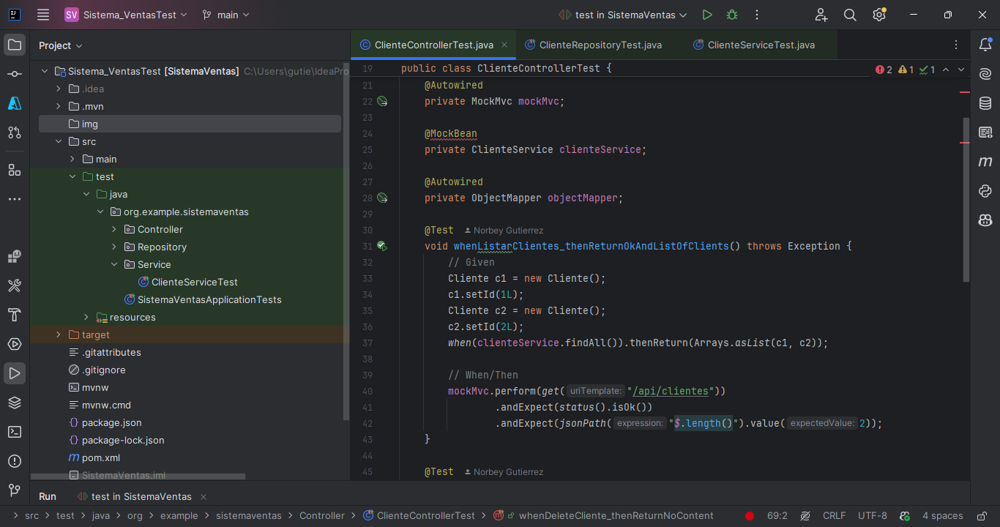
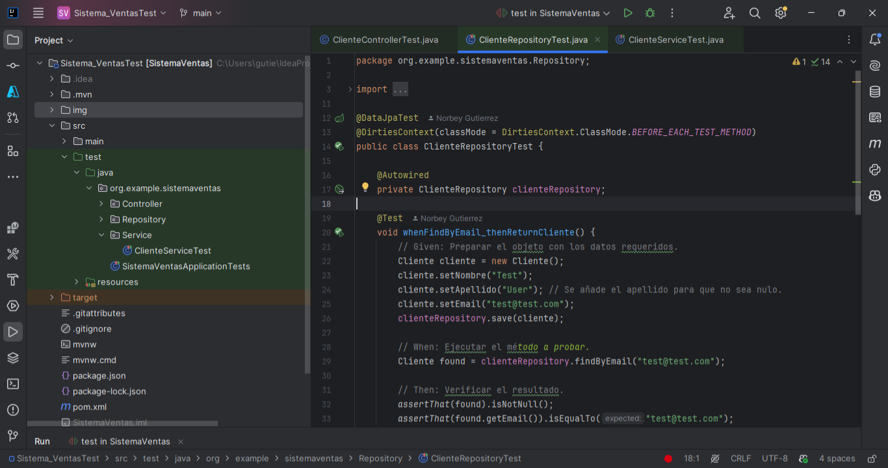
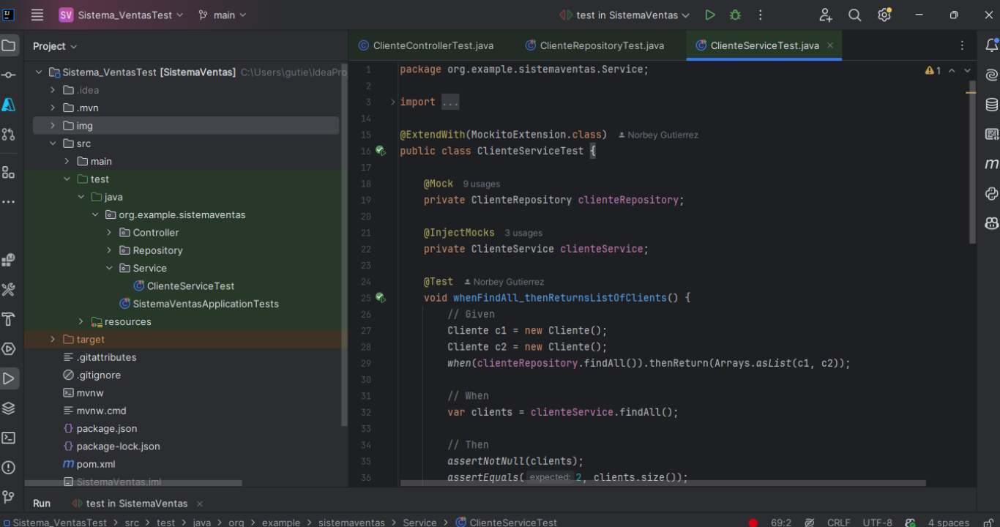
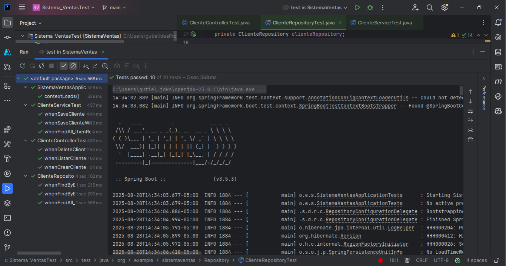

# 🛒 Sistema de Ventas
Aplicación desarrollada en Java (con Maven) para la gestión de ventas, clientes y productos, diseñada para optimizar el control de inventarios, registrar transacciones y generar reportes de manera eficiente.

## 📋 Características principales

### - 👤 Gestión de clientes: 
CRUD completo (crear, leer, actualizar, eliminar).
### - 📦 Control de inventario: 
Alta, baja y modificación de productos.
### - 🧾 Registro de ventas y generación de facturas.
### - 📊 Reportes básicos para análisis rápido.
### - 🛠 Arquitectura modular, fácil de mantener y escalar.

## 🛠️ Tecnologías utilizadas

### - Java 17}
Para la logica del negocio.
### - Maven
Para gestión de dependencias y build.
### - JUnit5
para pruebas unitarias.
### - MySQL
Para la base de datos.

## 📂 Estructura del proyecto
Sistema_Ventas/
 ├── src/               # Código fuente
 ├── pom.xml            # Configuración de Maven
 ├── .gitignore
 └── README.md

## 🚀 Instalación y ejecución

### - Clonar el repositorio
git clone https://github.com/Norbey32/Sistema_Ventas.git
cd Sistema_Ventas
### - Compilar el proyecto
mvn clean install
### - Ejecutar la aplicación
mvn spring-boot:run

## 🧪 Ejecución de pruebas:

### Pantalla clientecontrollertest

### Pantalla clienterepositorytest

### Pantalla clienteservicetest

### Pantalla pruebaCRUDClientes

## Para correr las pruebas:
### - mvn test

## 📌 Próximas mejoras- Interfaz gráfica más atractiva.

### - Reportes avanzados en PDF/Excel.
### - Integración con pasarelas de pago.
### - Sistema de roles y permisos.

## 🤝 Contribución- Realiza un fork del repositorio.

### - Crea una rama (git checkout -b feature/nueva-funcionalidad).
### - Haz commit de tus cambios (git commit -m 'Agrega nueva funcionalidad').
### - Sube tu rama (git push origin feature/nueva-funcionalidad).
### - Abre un Pull Request.

## 📄 Licencia

Este proyecto está bajo la licencia MIT. Consulta el archivo LICENSE para más detalles.
